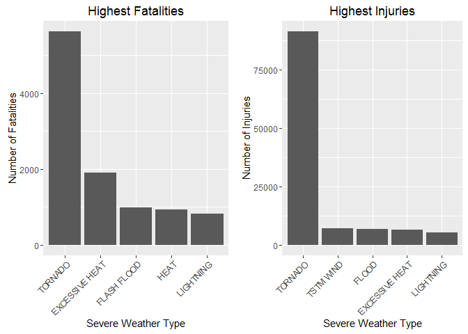
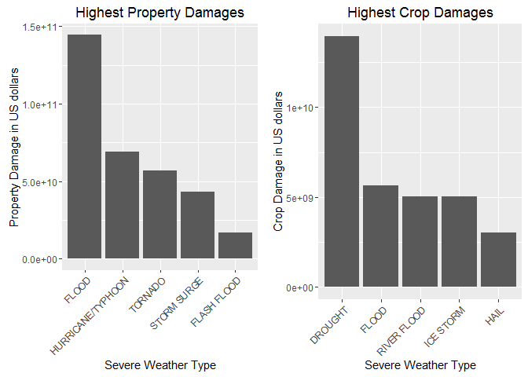

==========================================  
Reproducible Research: Peer Assessment 2  
by Gao, G. (2016-01-26)  
==========================================  

## Impact of Severe Weather Events on Public Health and Economy in the U.S.

### Synonpsis  

Storms and other severe weather events can cause both public health and economic problems for communities and municipalities. Many severe events can result in fatalities, injuries, and property damage, and preventing such outcomes to the extent possible is a key concern.

The goal of this report is to analyze the impact of different weather events on public health and economy based on the storm database collected from the U.S. National Oceanic and Atmospheric Administration's (NOAA) from 1950 to 2011. We will use the estimates of fatalities, injuries, property and crop damages to evaluate which types of events are most harmful to the public health and economy. 

### Settings

```r
echo = TRUE  
library(R.utils)
```

```
## Warning: package 'R.utils' was built under R version 3.2.3
```

```
## Loading required package: R.oo
```

```
## Warning: package 'R.oo' was built under R version 3.2.3
```

```
## Loading required package: R.methodsS3
```

```
## Warning: package 'R.methodsS3' was built under R version 3.2.3
```

```
## R.methodsS3 v1.7.0 (2015-02-19) successfully loaded. See ?R.methodsS3 for help.
```

```
## R.oo v1.19.0 (2015-02-27) successfully loaded. See ?R.oo for help.
```

```
## 
## Attaching package: 'R.oo'
```

```
## The following objects are masked from 'package:methods':
## 
##     getClasses, getMethods
```

```
## The following objects are masked from 'package:base':
## 
##     attach, detach, gc, load, save
```

```
## R.utils v2.2.0 (2015-12-09) successfully loaded. See ?R.utils for help.
```

```
## 
## Attaching package: 'R.utils'
```

```
## The following object is masked from 'package:utils':
## 
##     timestamp
```

```
## The following objects are masked from 'package:base':
## 
##     cat, commandArgs, getOption, inherits, isOpen, parse, warnings
```

```r
library(ggplot2)
```

```
## Warning: package 'ggplot2' was built under R version 3.2.3
```

```r
library(plyr)
require(gridExtra)
```

```
## Loading required package: gridExtra
```

```
## Warning: package 'gridExtra' was built under R version 3.2.3
```

### Data Processing  

Download and uncompress the bz2 data file, then read the csv file.


```r
setwd("~/RepData_PeerAssessment2")
if (!"repdata-data-StormData.csv.bz2" %in% dir(".")) {
   download.file("https://d396qusza40orc.cloudfront.net/repdata%2Fdata%2FStormData.csv.bz2", destfile = "repdata-data-StormData.csv.bz2")
bunzip2("repdata-data-StormData.csv.bz2", overwrite=T, remove=F)
}
storm <- read.csv("repdata-data-StormData.csv", sep = ",")
```

#### Impact on Public Health

We check the number of **fatalities** and **injuries** that are caused by the severe weather events. The five most severe weather events are reported.


```r
sorting <- function(fieldName, top = 5, dataset = storm) {
    index <- which(colnames(dataset) == fieldName)
    field <- aggregate(dataset[, index], by = list(dataset$EVTYPE), FUN = "sum")
    names(field) <- c("EVTYPE", fieldName)
    field <- arrange(field, field[, 2], decreasing = T)
    field <- head(field, n = top)
    field <- within(field, EVTYPE <- factor(x = EVTYPE, levels = field$EVTYPE))
    return(field)
}

fatalities <- sorting("FATALITIES", dataset = storm)
injuries <- sorting("INJURIES", dataset = storm)
```

#### Impact on Economy

Since the **property damage** and **crop damage** data are in different units, a conversion is needed. The units used in the data file are Hundred (H), Thousand (K), Million (M), and Billion (B).


```r
converting <- function(dataset = storm, fieldName, newFieldName) {
    totalLen <- dim(dataset)[2]
    index <- which(colnames(dataset) == fieldName)
    dataset[, index] <- as.character(dataset[, index])
    logic <- !is.na(toupper(dataset[, index]))
    dataset[logic & toupper(dataset[, index]) == "B", index] <- "9"
    dataset[logic & toupper(dataset[, index]) == "M", index] <- "6"
    dataset[logic & toupper(dataset[, index]) == "K", index] <- "3"
    dataset[logic & toupper(dataset[, index]) == "H", index] <- "2"
    dataset[logic & toupper(dataset[, index]) == "", index] <- "0"
    dataset[, index] <- as.numeric(dataset[, index])
    dataset[is.na(dataset[, index]), index] <- 0
    dataset <- cbind(dataset, dataset[, index - 1] * 10^dataset[, index])
    names(dataset)[totalLen + 1] <- newFieldName
    return(dataset)
}

storm <- converting(storm, "PROPDMGEXP", "propertyDamage")
```

```
## Warning in converting(storm, "PROPDMGEXP", "propertyDamage"): NAs
## introduced by coercion
```

```r
storm <- converting(storm, "CROPDMGEXP", "cropDamage")
```

```
## Warning in converting(storm, "CROPDMGEXP", "cropDamage"): NAs introduced by
## coercion
```

```r
property <- sorting("propertyDamage", dataset = storm)
crop <- sorting("cropDamage", dataset = storm)
```

### Results

Plots of total fatalities and total injuries caused by the top 5 severe weather events are generated. 


```r
fatalitiesPlot <- qplot(EVTYPE, data = fatalities, weight = FATALITIES) + 
    scale_y_continuous("Number of Fatalities") + 
    theme(axis.text.x = element_text(angle = 45, 
    hjust = 1)) + xlab("Severe Weather Type") + 
    ggtitle("Highest Fatalities")
injuriesPlot <- qplot(EVTYPE, data = injuries, weight = INJURIES) + 
    scale_y_continuous("Number of Injuries") + 
    theme(axis.text.x = element_text(angle = 45, 
    hjust = 1)) + xlab("Severe Weather Type") + 
    ggtitle("Highest Injuries")
grid.arrange(fatalitiesPlot, injuriesPlot, ncol = 2)
```

\

We found that **tornado** causes most fatalities and injuries in the United States.

Plots of total property damage and total crop damage caused by the top 5 severe weather events are also generated. 


```r
propertyPlot <- qplot(EVTYPE, data = property, weight = propertyDamage) + 
    theme(axis.text.x = element_text(angle = 45, hjust = 1)) + scale_y_continuous("Property Damage in US dollars")+ 
    xlab("Severe Weather Type") + ggtitle("Highest Property Damages")

cropPlot<- qplot(EVTYPE, data = crop, weight = cropDamage) + 
    theme(axis.text.x = element_text(angle = 45, hjust = 1)) + scale_y_continuous("Crop Damage in US dollars") + 
    xlab("Severe Weather Type") + ggtitle("Highest Crop Damages")
grid.arrange(propertyPlot, cropPlot, ncol = 2)
```

\

We found that **flood** causes most property damage, while **drought** causes most crop damage in the United States.

### Conclusion  

Based on this analysis, we found that **tornado** is the most harmful with respect to public health, while **flood** and **drought** have the greatest economic impact.
